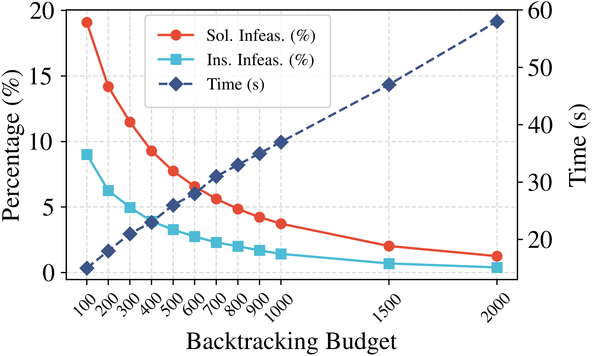

# LMask: Learn to Solve Constrained Routing Problems with Lazy Masking 
<details>
    <summary><strong>Overview</strong></summary>
<p align="center"></p>
</details>

## Installation
We  recommend installing the environment from the file by running the following commands
```bash
conda create -n lmask python=3.10
conda activate lmask
pip install -r requirements.txt
```
<!-- - Main Python packages:
  * PyTorch = 2.5.1
  * RL4CO = 0.5.2
  * TensorDict = 0.6.2
  * pytorch-lightning = 2.5.0 
  * PyVRP = 0.11.0
  * Numpy = 2.2.6
  * Pandas
  * tqdm -->
  

## Quickstart
### Generate Datasets
The validation and test datasets can be generated by running the following command:
```bash
python generate_datasets.py
```
### Test
* Test a specific random dataset
```bash
python driver/test.py --problem tsptw --problem_size 50 --hardness hard
```
You can also provide additional parameters like `max_backtrack_steps` and `lookahead_step` (see the script for more details).
* Test all datasets
```bash
python driver/test_all.py
```

* Test Dumas benchmark instances for TSPTW
```bash
python driver/test_dumas.py
```

### Training
```bash
python run.py experiment=main/tsptw/tsptw50-medium
```
You may change the experiment `experiment=main/tsptw/tsptw50-medium` by using the `experiment=YOUR_EXP`, with the path under [`configs/experiment`](configs/experiment) directory.

**Note**: After training, to use the checkpoints in test.py, you should first run the script `sripts/transform_checkpoints.py` to convert ckpt files to pth files.

## Results
### Backtracking vs. Lookahead
<p align="center">
  
</p>

### Effect of Backtracking Budget
<div style="text-align:center">
  <figure style="display:inline-block; width:100%; margin:0 1%; text-align:center;">
    
    <figcaption>SSL</figcaption>
  </figure>
  <figure style="display:inline-block; width:100%; margin:0 1%; text-align:center;">
    
    <figcaption>TSL</figcaption>
  </figure>
</div>

### Ablation Study on Refinement Intensity Embedding
<p align="center">
  
</p>

### Effect of the Entropy Term
<p align="center">
  
</p>

## Citation
```bash
@article{li2025lmask,
  title={LMask: Learn to Solve Constrained Routing Problems with Lazy Masking},
  author={Li, Tianyou and Zou, Haijun and Wu, Jiayuan and Wen, Zaiwen},
  journal={arXiv preprint arXiv:2505.17938},
  year={2025}
}
```