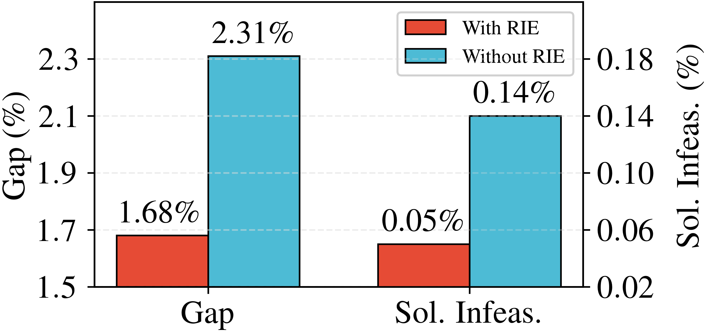
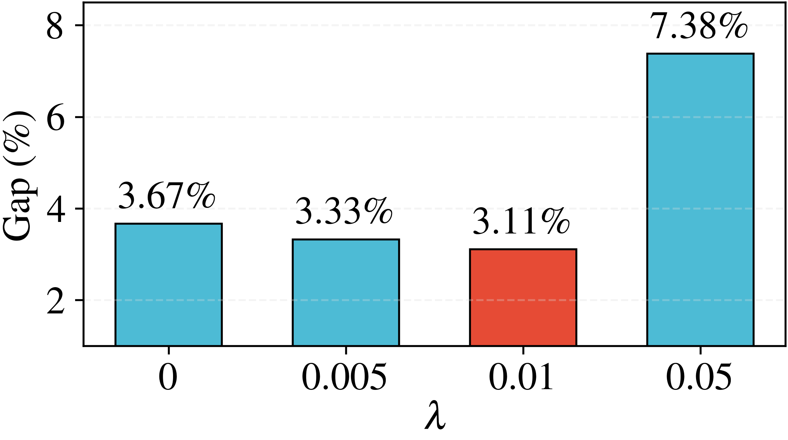

# LMask: Learn to Solve Constrained Routing Problems with Lazy Masking 
This is the implementation for the paper [LMask: Learn to Solve Constrained Routing Problems with Lazy Masking](https://arxiv.org/abs/2505.17938).
## Algorithm Framework
LMask is a novel learning framework that utilizes dynamic masking to generate high-quality feasible solutions for constrained routing problems. A wide range of routing problems can be expressed using the following formulation:
$$\min_{\pi\in \Pi} \quad f(\pi;\mathcal{P}),\quad
        \mathrm{s.t.} \quad c(\pi;\mathcal{P})\leq 0,\;d(\pi;\mathcal{P}) = 0,$$
where $\mathcal{P}$ represents the problem instance, $c(\pi;\mathcal{P})$ and $d(\pi;\mathcal{P})$ represent the hard constraints imposed on the route $\pi$. $d(\pi;\mathcal{P})=0$ can be the visit constraints that each node is exactly visited once. $c(\pi;\mathcal{P})\leq 0$ can represent time window constraints, draft limit constraints, etc.

The pipeline of LMask is displayed in the next figure. The core of LMask is the novel LazyMask decoding algorithm, which lazily refines feasibility masks with the backtracking mechanism. In addition, it employs the refinement intensity embedding  to mitigate representation ambiguities induced by backtracking. To reduce sampling cost, LMask sets a backtracking budget during decoding, while constraint violations are penalized in the loss function during training to counteract infeasibility caused by this budget. The overall training objective consists of three parts: the original RL loss, an $\ell_1$ penalty term for constraint violation, and an entropy regularization term. 
<p align="center"></p>

## Installation
We  recommend installing the environment from the file by running the following commands
```bash
conda create -n lmask python=3.10
conda activate lmask
pip install -r requirements.txt
```
  

## Quickstart
### Generate Datasets
The validation and test datasets can be generated by running the following command:
```bash
python generate_datasets.py
```
### Test
* **Test a specific random dataset**
```bash
python driver/test.py --problem tsptw --problem_size 50 --hardness hard
```
* **Test all datasets**
```bash
python driver/test_all.py
```

* **Test Dumas benchmark instances for TSPTW**
```bash
python driver/test_dumas.py
```

### Training
```bash
python run.py experiment=main/tsptw/tsptw50-medium
```
You may change the experiment `experiment=main/tsptw/tsptw50-medium` by using the `experiment=YOUR_EXP`, with the path under [`configs/experiment`](configs/experiment) directory. **Note**: After training, to use the checkpoints in test.py, you should first run the script `scripts/transform_checkpoints.py` to convert ckpt files to pth files.

## Results
### Backtracking vs. Lookahead
The following figure shows results across different lookahead steps. With two-step lookahead (TSL), LMask attains a zero solution infeasibility rate within 20s. Even with the less accurate single-step lookahead (SSL), LMask drives the infeasibility rate down to the second lowest level by allocating a larger backtracking budget. However, PIP and PIP-D exhibit unacceptably high infeasibility rates under SSL. Increasing the lookahead step from 2 to 3 induces an order of magnitude rise in inference time while yielding only marginal gains and the outcomes remain inferior to LMask under SSL with $R=700$. These results demonstrate that backtracking combined with a lightweight lookahead initialization is more efficient than methods that rely exclusively on deeper lookaheads. 
<p align="center">
  
</p>

### Effect of Backtracking Budget
The following figure demonstrates how the backtracking budget $R$ influences the performance of LMask under TSL. The results show that inference time exhibits a nearly linear growth with respect to $R$, with an increase of approximately 2 seconds per 100 additional backtracking budget, demonstrating manageable computational overhead. In contrast, infeasibility rates decrease sharply at small values of $R$, indicating substantial early-stage gains in feasibility. Notably, instance infeasibility effectively vanishes at $R=100$, requiring only 17 seconds of inference time. These results highlight that larger backtracking budgets substantially improve solution feasibility with modest increases in runtime.
<p align="center">
  
</p>

<!-- ### Ablation Study on Refinement Intensity Embedding
<p align="center">
  
</p>

### Effect of the Entropy Term
In the following figure, we report the results on easy TSPTW-100  for models trained with different entropy coefficients $\lambda$. The optimality gap exhibits a non-monotonic pattern. It decreases as $\lambda$ increases from 0 to 0.01, achieving the best performance at $\lambda=0.01$, but then rises significantly at $\lambda=0.05$. 
This reflects the intrinsic trade-off between exploration and concentration in the probabilistic model, and suggests that choosing an appropriate entropy coefficient can improve solution optimality. This observation also aligns with our theoretical analysis in our paper.
<p align="center">
  
</p> -->

## Citation
```bash
@article{li2025lmask,
  title={LMask: Learn to Solve Constrained Routing Problems with Lazy Masking},
  author={Li, Tianyou and Zou, Haijun and Wu, Jiayuan and Wen, Zaiwen},
  journal={arXiv preprint arXiv:2505.17938},
  year={2025}
}
```