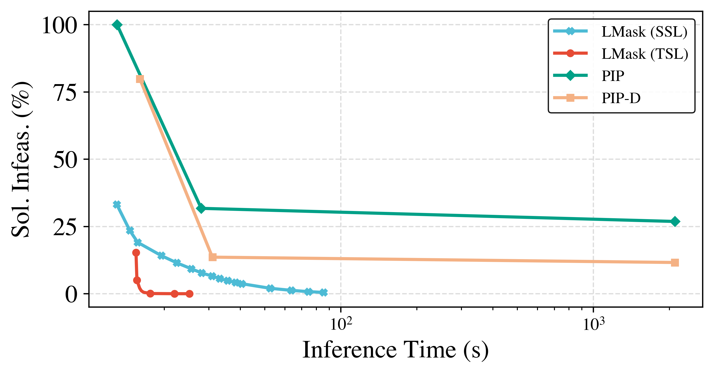
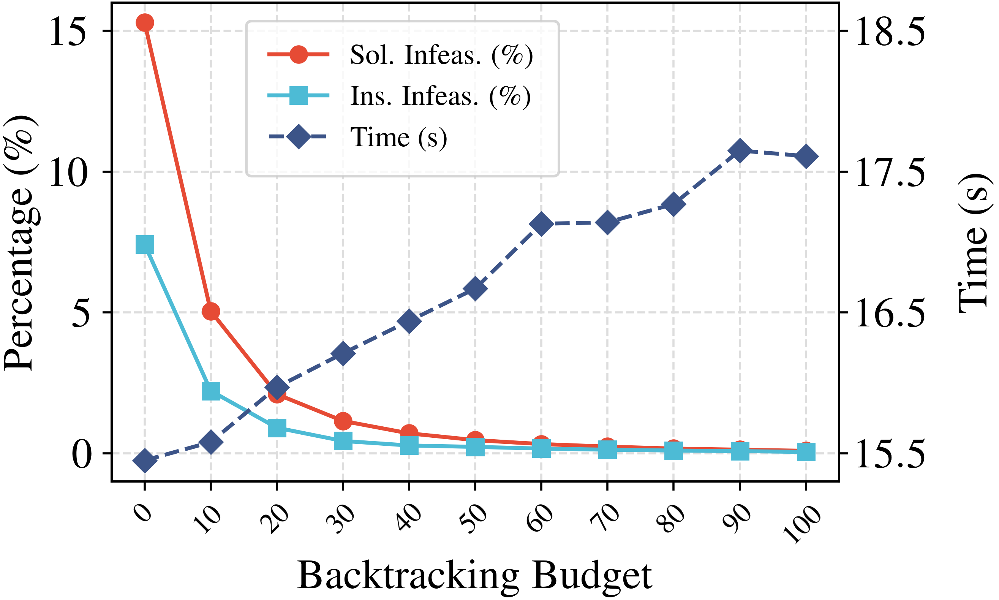
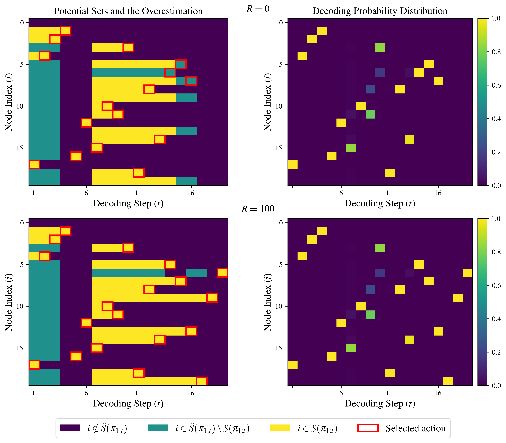

# LMask: Learn to Solve Constrained Routing Problems with Lazy Masking 
This is the implementation for the paper [LMask: Learn to Solve Constrained Routing Problems with Lazy Masking](https://arxiv.org/abs/2505.17938).
## Algorithm Framework
LMask is a novel learning framework that utilizes dynamic masking to generate high-quality feasible solutions for constrained routing problems. A wide range of routing problems can be expressed using the following formulation:
$$\min_{\pi\in \Pi} \quad f(\pi;\mathcal{P}),\quad
        \mathrm{s.t.} \quad c(\pi;\mathcal{P})\leq 0,d(\pi;\mathcal{P}) = 0,$$

where $\mathcal{P}$ represents the problem instance, $c(\pi;\mathcal{P})$ and $d(\pi;\mathcal{P})$ represent the hard constraints imposed on the route $\pi$. $d(\pi;\mathcal{P})=0$ can be the visit constraints that each node is exactly visited once. $c(\pi;\mathcal{P})\leq 0$ can represent time window constraints, draft limit constraints, etc.

The pipeline of LMask is displayed in the next figure. The core of LMask is the novel LazyMask decoding algorithm, which lazily refines feasibility masks with the backtracking mechanism. In addition, it employs the refinement intensity embedding  to mitigate representation ambiguities induced by backtracking. To reduce sampling cost, LMask sets a backtracking budget during decoding, while constraint violations are penalized in the loss function during training to counteract infeasibility caused by this budget. The overall training objective consists of three parts: the original RL loss, an $\ell_1$ penalty term for constraint violation, and an entropy regularization term. 
<p align="center"></p>

## Installation
We  recommend installing the environment from the file by running the following commands
```bash
conda create -n lmask python=3.10
conda activate lmask
pip install -r requirements.txt
```
  

## Code Structure
```
    ├── baselines            : Baseline solver implementations.
    ├── configs              : Training configs (Hydra).
    ├── data                 : Generated problem instances for validation/test.
    ├── driver               : Scripts to reproduce experiments and benchmarks.
    ├── scripts              : Utility scripts (e.g., checkpoint conversion).
    ├── lmask                : Core LMask codebase.
    |   ├── envs             
    |   |   ├── base.py      : LazyMask core algorithm and env base.
    |   |   ├── tsptw        : TSP with time windows environment.
    |   |   └── tspdl        : TSP with draft limit environment.
    |   ├── models           : Policy networks (policy.py) and train/val step logic (model.py).
    |   └── utils            : Data/metric helpers and common ops.
    ├── generate_datasets.py : Dataset generation entry.
    └── run.py               : Main training entry (Hydra).
```

## Quickstart
### Generate Datasets
The validation and test datasets can be generated by running the following command:
```bash
python generate_datasets.py
```
### Test
Run one of the commands below for basic testing. For reproducing experiments, `driver/test_all.py` already sets the parameters. If you use `driver/test.py`, you may want to tune key algorithm parameters yourself, such as the lookahead steps (`-L`) and the backtracking budget (`-R`).
```bash
# === Test a specific random dataset ===
python driver/test.py --problem tsptw --problem_size 50 --hardness hard
# === Test all datasets ===
python driver/test_all.py
# === Test Dumas benchmark instances for TSPTW ===
python driver/test_dumas.py
```

### Training
```bash
python run.py experiment=main/tsptw/tsptw50-medium
```
You may change the experiment `experiment=main/tsptw/tsptw50-medium` by using the `experiment=YOUR_EXP`, with the path under [`configs/experiment`](configs/experiment) directory. **Note**: After training, to use the checkpoints in test.py, you should first run the script `scripts/transform_checkpoints.py` to convert ckpt files to pth files.

## Results
### Results on TSPTW synthetic datasets
Partial results on TSPTW synthetic datasets across different hardness levels are presented in the following two tables. Some conclusions can be drawn:
- Compared with traditional solvers (PyVRP, LKH3 and OR-Tools), LMask has a clear advantage in algorithmic efficiency due to the inference capability of neural networks. While traditional heuristics operate on the magnitude of hours or even days—specifically, on the Hard ($n=100$) dataset, PyVRP requires $4.3\text{h}$ and LKH3 takes as long as $1\text{d}8\text{h}$—LMask accomplishes the same task with second-level latency, requiring only $18\text{s}$.
  
- Compared with other neural constructive solvers (PIP and PIP-D), LMask consistently achieves zero infeasibility rates and significantly smaller optimality gaps.
  
**Results on the medium TSPTW-100 dataset**
| Method | Infeasible Sol. | Infeasible Inst. | Obj. | Gap | Time |
| :--- | :---: | :---: | :---: | :---: | :---: |
| PyVRP | - | 0.00% | 18.72 | * | 4.3h |
| LKH3 | - | 0.01% | 18.74 | 0.16% | 10.3h |
| OR-Tools | - | 0.52% | 18.98 | 1.40% | 4.3h |
| PIP | 4.35% | 0.39% | 19.61 | 4.79% | 29s |
| PIP-D | 3.46% | 0.03% | 19.80 | 5.76% | 31s |
| LMask | **0.05%** | **0.00%** | **19.51** | **4.23%** | 18s |

**Results on the hard TSPTW-100 datasets**
| Method | Infeasible Sol. | Infeasible Inst. | Obj. | Gap | Time |
| :--- | :---: | :---: | :---: | :---: | :---: |
| PyVRP | - | 0.01% | 51.27 | 0.00% | 4.3h |
| LKH3 | - | 0.95% | 51.27 | 0.00% | 1d8h |
| OR-Tools | - | 89.25% | 51.72 | 0.00% | 0.5h |
| PIP | 31.74% | 16.68% | 51.48 | 0.37% | 28s |
| PIP-D | 13.59% | 6.60% | 51.43 | 0.32% | 31s |
| LMask | **0.00%** | **0.00%** | **51.38** | **0.21%** | 18s |

### Backtracking vs. Lookahead
The following figure reports solution infeasibility against inference time. It compares four methods, LMask with SSL training, LMask with TSL training, PIP, and PIP-D. For LMask, longer inference time is obtained by increasing the backtracking budget. For PIP and PIP-D, longer inference time is obtained by increasing the lookahead depth. The results show that 
- Relying solely on computationally expensive lookaheads creates a significant trade off between mask accuracy and efficiency. 
- Backtracking offers a flexible and powerful way to handle complex constraints because it enables the use of a lightweight overestimation strategy.

<p align="center">
  
</p>

### Effect of Backtracking Budget
The following figure demonstrates how the backtracking budget $R$ influences the performance of LMask under TSL. The results show that inference time exhibits a nearly linear growth with respect to $R$, with an increase of approximately 2 seconds per 100 additional backtracking budget, demonstrating manageable computational overhead. In contrast, infeasibility rates decrease sharply at small values of $R$, indicating substantial early-stage gains in feasibility. Notably, instance infeasibility effectively vanishes at $R=100$, requiring only 17 seconds of inference time. These results highlight that larger backtracking budgets substantially improve solution feasibility with modest increases in runtime.
<p align="center">
  
</p>

### Visualization of the Decoding Process
The next figure visualizes the LazyMask decoding process on a small TSPDL instance, using two trials with different backtracking budgets. The top row corresponds to $R=0$ and the bottom row corresponds to $R=100$. In the left column, the x axis is the decoding step $t$ and the y axis is the node index $i$. Colors indicate set membership relative to the true potential set $S(\pi_{1:t})$ and its overestimation $\hat S(\pi_{1:t})$. Dark blue denotes $i\notin \hat S(\pi_{1:t})$, teal denotes $i\in \hat S(\pi_{1:t})\setminus S(\pi_{1:t})$, and yellow denotes $i\in S(\pi_{1:t})$. The node selected by the policy at each step is marked by a red bounding box. For a failed trial, the visualization is truncated at the step where $S(\pi_{1:t})$ becomes empty after the backtracking budget is exhausted. The right column reports the corresponding decoding distribution $p_\theta(\cdot\mid \pi_{1:t})$ at each step.

As demonstrated, the policy trained with $\ell_1$ penalty  has a support close to the feasible region, so early greedy choices fall in $S(\pi_{1:t})$ even when $\hat S(\pi_{1:t})$ is loose. Nevertheless, the policy makes a wrong selection at $t=14$, and the algorithm continues to extend until $t=17$ where no node remains selectable. Backtracking is then triggered and alternates with further extensions to eliminate the incorrect choice. A small budget such as $R=100$ is sufficient to recover and complete a feasible route, while $R=0$ fails.

<p align="center">
  
</p>

## Contact
We hope that the package is useful for your application. If you have any questions related to the code or the paper, please feel free to email one of the following authors:
- Haijun Zou, `haijunzou10853@gmail.com`
- Tianyou Li, `tianyouli0831@gmail.com`
- Zaiwen Wen, `wenzw@pku.edu.cn`

If you encounter any problems when using the code, or want to report a bug, you can open an issue. Please provide specific details about the problem so that we can assist you more effectively and efficiently!

## Citation
```bash
@inproceedings{li2025lmask,
  title={LMask: Learn to Solve Constrained Routing Problems with Lazy Masking},
  author={Tianyou Li and Haijun Zou and Jiayuan Wu and Zaiwen Wen},
  booktitle={The Fourteenth International Conference on Learning Representations},
  year={2026}
}
```
